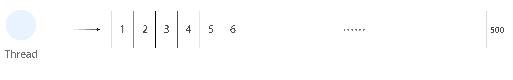
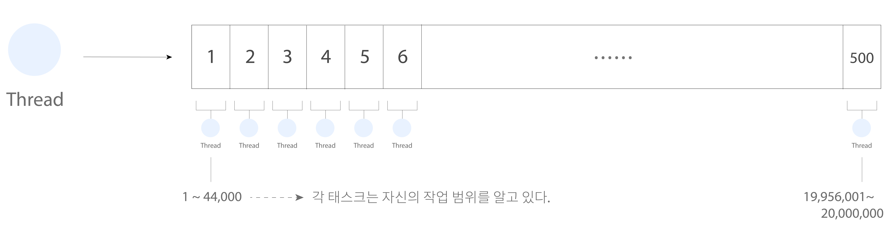
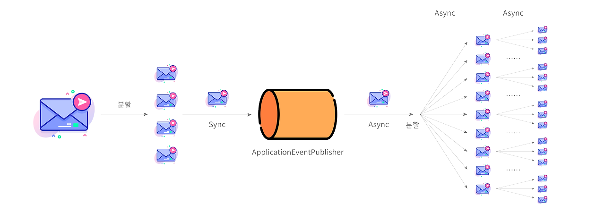

# Full Table Scan with Async & Parallel

비동기를 활용한 테이블 풀 스캔 성능 테스트.

> 테이블 풀 스캔은 테이블의 모든 row를 조회하기 때문에, 데이터가 많을 경우 일반적으로 권장되지 않습니다. 하지만 데이터가 많더라도 `분할`과 `비동기를 활용한 병렬 처리`를 하면 특정 상황에서는 꽤 좋은
> 성능을 낼 수 있습니다.

<br/><br/><br/><br/>

## 1. 요구 사항

이벤트 플로우는 다음과 같습니다. 알림 송신은 별도의 시스템이 필요하기 때문에 고려하지 않습니다.

1. 알림 메시지를 전송한다.
2. 전체 사용자는 2,000 만 명이며, 알림 수신에 동의한 사용자에게만 알림을 전송한다.
3. 단일 애플리케이션/데이터베이스를 사용한다.

<br/><br/><br/><br/>

### Step1. 비동기를 활용해 알림을 전송한다.

데이터가 많을 경우, 테이블 풀 스캔을 사용하면 모든 row를 읽기 때문에 시간이 오래 걸릴 수 있으므로, `비동기`를 활용해 이를 개선한다.

1. 비동기로 데이터를 처리한다.
2. 모니터링을 통해 자원 사용률을 체크한다.

<br/><br/><br/>

### Step2. 태스크 유실을 대비한다.

메세지 큐(Message Queue)를 사용하는 경우, 의도치 않게 태스크가 유실되는 경우 가 발생한다. 메시지가 유실될 경우, 이를 대비할 수 있도록 한다.

1. 메시지 유실을 대비한다.
2. 메시지 큐는 어떤 것을 사용해도 상관없다.
3. 외부 메시징 시스템을 도입했을 시, 성능 변화를 측정한다.

<br/><br/><br/><br/><br/><br/>

## 2. 아이디어

아이디어는 `분할`과 `비동기를 활용한 병렬 처리` 입니다.

- 분할
- 비동기를 활용한 병렬 처리

<br/><br/><br/><br/>

먼저 하나의 큰 태스크를 적절한 단위(chunk)로 분할합니다.



<br/><br/><br/><br/><br/><br/>

각 태스크는 자신이 처리할 작업의 시작/끝점을 알고 있습니다. 이를 통해 `데이터 중복 처리를 방지`하며, `인덱스(Index)를 활용`할 수 있게 됩니다.



<br/><br/><br/><br/><br/><br/>

이후 각 태스크를 `비동기를 통한 병렬로 처리`합니다.



<br/><br/><br/><br/><br/><br/>

## 3. 결과

2,000만 건 처리 시 1분 ~ 1분 45초. 

```shell
# 약, 1분 31초(91.16)
127.0.0.1:6379> get time::string::startTime
"1710619193857"
127.0.0.1:6379> get time::string::endTime
"1710619285018"
```

```shell
# 약 1분 26초(86.45)
127.0.0.1:6379> get time::string::startTime
"1710619455453"
127.0.0.1:6379> get time::string::endTime
"1710619541899"
```

```shell
# 약 1분 38초(98.73)
127.0.0.1:6379> get time::string::startTime
"1710619665364"
127.0.0.1:6379> get time::string::endTime
"1710619764089"
```

<br/><br/><br/><br/><br/><br/>

## 4. 한계

태스크 실행 중 새로운 데이터가 추가 됐을 때, 이를 처리할 수 있는 방안이 없습니다. 예를 들어, 2,000만 사용자에게 알림을 발송하는 도중 새로운 사용자가 가입을 한다면 이를 대처할 방법이 없습니다. 따라서
모든 로직이 끝난 후, 새로 추가된 사용자들은 별도의 로직으로 처리해줘야 합니다.

```kotlin
interface UserRepository : JpaRepository<User, Long> {
    @Query("SELECT u FROM user u WHERE u.id > maxUserId")
    fun findByIdOver(maxUserId: Long): List<User>
}
```

> 또한 이 외에도 쓰레드 풀 개수 설정, 커넥션 관리, 모니터링 등의 추가 이슈가 있습니다. 상세 내용은 블로그를 참조해주세요.
